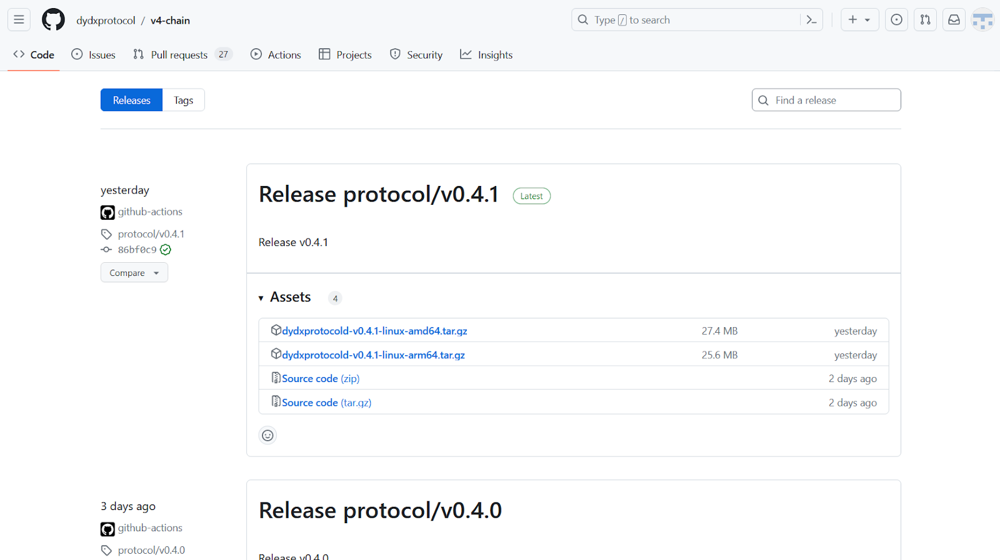

# How to set up a full node

***By using, recording, referencing, or downloading (i.e., any “action”) any information contained on this page or in any dYdX Operations Services Ltd. ("dYdX Operations subDAO") database, you hereby and thereby agree to the [dYdX Chain Docs Terms of Use](../terms_and_policies/terms_of_use) governing such information, and you agree that such action establishes a binding agreement between you and dYdX Operations subDAO.***

## Pre-requisite
1. Linux (Ubuntu Server 22.04.3 recommended)
2. 8-cpu (ARM or x86_64), 64 GB RAM, 500 GB SSD NVME Storage

## Get the dydxprotocold binary and initialize the data directory
1. From https://github.com/dydxprotocol/v4-chain/releases/ | Look for the `protocol` assets.
2. For example, as of `10/19/2023`, this was the correct binary to use:

3. Download, extract, and rename the binary to `dydxprotocold`.  Move it to a directory in your `$PATH`.  Now, initialize the data directory (create the directory first if it doesn’t exist).  Note in the example below, `chain-id=dydx-mainnet-1`, the data `directory=/home/vmware/.dydx-mainnet-1`, and the nickname for the full node is `mydydxfullnodemainnnet`:
```bash
dydxprotocold init --chain-id=dydx-mainnet-1 --home=/home/vmware/.dydx-mainnet-1 mydydxfullnodemainnet
```

## Get the latest applicable genesis.json file and install
1. Use 
```bash
curl https://dydx-ops-rpc.kingnodes.com/genesis | python3 -c 'import json,sys;print(json.dumps(json.load(sys.stdin)["result"]["genesis"], indent=2))' > genesis.json 
```
to get the applicable Genesis state of the network.

2. Copy the applicable `genesis.json` file to the data directory’s `config/` directory
3. (Alternatives): If the RPC endpoint above does not work, there are these alternatives:
 - https://dydx-dao-rpc.polkachu.com/genesis
 - https://dydx-mainnet-full-rpc.public.blastapi.io/genesis
 - https://dydx-rpc.lavenderfive.com/genesis
 - https://dydx.rpc.kjnodes.com/genesis
 - https://rpc.dydx.nodestake.top/genesis
 - https://dydx-mainnet-rpc.autostake.com:443/genesis
 - Also check [Full node endpoints → RPC](../networks/network1/resources.md#full-node-endpoints)

## Install Bware’s snapshot (optional but saves days)
1. From https://bwarelabs.com/snapshots/dydx
2. Download and extract (using `lz4 -dc < snapshotfile.tar.lz4 | tar xf -`) the snapshot contents in the data directory (make sure you are in the data directory before running the tar command).  Important: The data directory (`/home/vmware/.dydx-mainnet-1/` in our example) contains another `data/` directory.
3. (Alternatives): If the above is not available, there are these alternatives:
 - https://polkachu.com/tendermint_snapshots/dydx
 - https://services.lavenderfive.com/mainnet/dydx/snapshot
 - https://services.kjnodes.com/mainnet/dydx/snapshot
 - https://nodestake.top/dydx
 - https://autostake.com/networks/dydx/#services
 - https://genznodes.dev/resources/snapshot/dydx
 - Also check [“Snapshot service → Snapshots](../networks/network1/resources.md#snapshot-service)

## Start the full node
1. Start the full node. Note that you may need to change the `--p2p.seeds` parameter depending on the applicable v4 software blockchain network – you can find an example on [Resources page under “Seed nodes”](../networks/network1/resources.md#seed-nodes)
```bash
nohup dydxprotocold start --p2p.seeds="ade4d8bc8cbe014af6ebdf3cb7b1e9ad36f412c0@seeds.polkachu.com:23856,65b740ee326c9260c30af1f044e9cda63c73f7c1@seeds.kingnodes.net:23856,f04a77b92d0d86725cdb2d6b7a7eb0eda8c27089@dydx-mainnet-seed.bwarelabs.com:36656,20e1000e88125698264454a884812746c2eb4807@seeds.lavenderfive.com:23856,c2c2fcb5e6e4755e06b83b499aff93e97282f8e8@tenderseed.ccvalidators.com:26401,4f20c3e303c9515051b6276aeb89c0b88ee79f8f@seed.dydx.cros-nest.com:26656,a9cae4047d5c34772442322b10ef5600d8e54900@dydx-mainnet-seednode.allthatnode.com:26656,802607c6db8148b0c68c8a9ec1a86fd3ba606af6@64.227.38.88:26656,400f3d9e30b69e78a7fb891f60d76fa3c73f0ecc@dydx.rpc.kjnodes.com:17059,4c30c8a95e26b07b249813b677caab28bf0c54eb@rpc.dydx.nodestake.top:666,ebc272824924ea1a27ea3183dd0b9ba713494f83@dydx-mainnet-seed.autostake.com:27366" --home=/home/vmware/.dydx-mainnet-1 --non-validating-full-node=true > /tmp/fullnodemainnet.log 2>&1 &
```
2. You can tail the log to see the progress.
```bash
tail -f /tmp/fullnodemainnet.log
```
3. The full node is now syncing. To determine whether the full node is caught up with the chain head, please check the applicable block explorer to determine when it reaches the current block – an example block explorer is shown on https://www.mintscan.io/dydx

## Things you can do with the full node
GET CURRENT BLOCK: You can get the current block with this program https://github.com/chiwalfrm/dydxexamples/blob/main/v4block_subscribe.py 

Run it with the full node IP address and port `26657`:
```bash
python3 v4block_subscribe.py ws://<IPADDRESS>:26657
```
Where `<IPADDRESS>` is the IP address of your full node.
